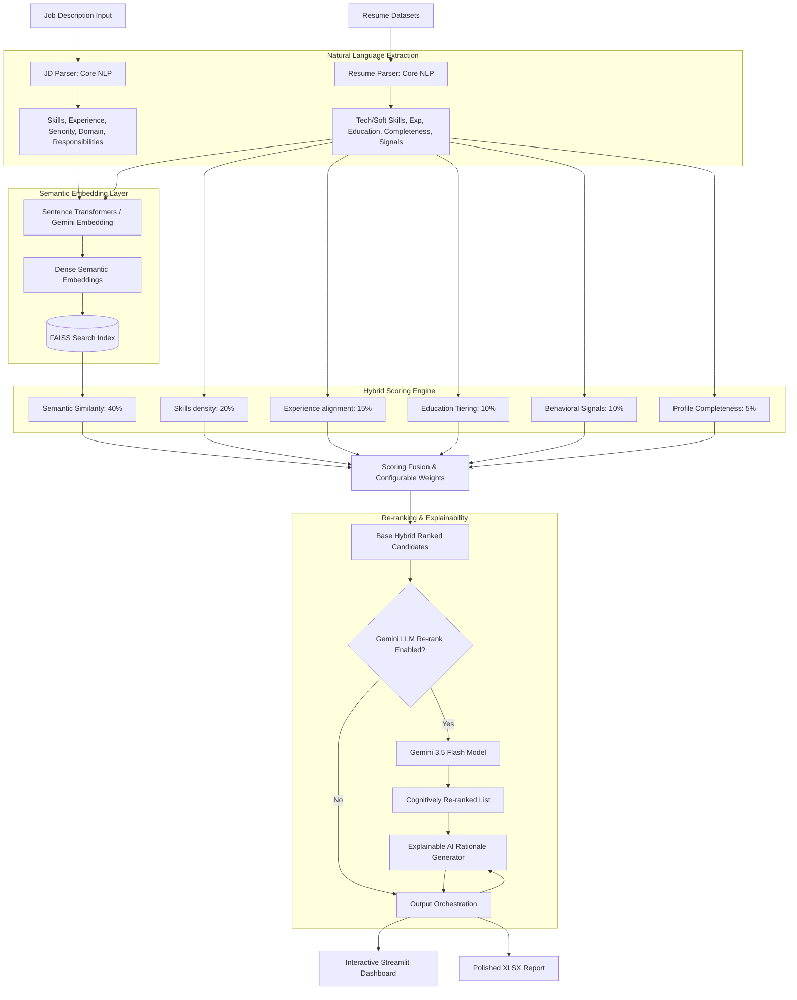

# TalentMind-AI — Candidate Ranking & Semantic Search Engine

An AI-powered recruiter intelligence system built for the **INDIA RUNS Data & AI Challenge**. TalentMind-AI transcends primitive keyword-matching ATS systems by utilizing NLP parsing, dense embedding retrievals (Sentence Transformers & FAISS), multi-criteria hybrid scoring, and state-of-the-art LLM re-ranking (Gemini API) to match job descriptions to candidate resumes like an experienced technical recruiter.

---

## 🚀 Key Capabilities

- **Deep NLP Parser**: Extracted skills, years of experience, certifications, leadership signals, and achievements from unstructured profiles and JDs.
- **Dense Vector Search**: Powered by `sentence-transformers` and `faiss-cpu` for real-time semantic retrieval of deep conceptual fits.
- **Configurable Multi-Criteria Ranking Engine**: Hybrid scoring algorithm analyzing semantic alignment, skill density, experience overlap, education prestige, behavioral signals, and profile completeness.
- **Explainable AI (XAI)**: Generates detailed natural language matching rationales for every ranking.
- **Optional Gemini LLM Re-Ranking**: Activates an optional cognitive refinement layer to assess deep behavioral and project nuances.
- **Recruiter-Centric Dashboard**: Built with Streamlit, enabling resume-to-JD uploads, interactive ranking views, dynamic weights control, semantic querying, and analytical charts.

---

## 📐 System Architecture



---

## 📂 Project Structure

```text
TalentMind-AI/
├── README.md                 # Project Overview & Execution Manual
├── requirements.txt          # Python Dependency Declarations
├── main.py                   # Master Pipeline Entry Point
├── config.py                 # Central Configuration & Weight Managers
├── embedding.py              # Dense Vector Generators (Sentence Transformers)
├── jd_parser.py              # Job Description Information Extractor
├── candidate_parser.py       # Candidate Profile parser (NLP)
├── ranking_engine.py         # FAISS Indexing & Search Engine
├── scoring.py                # Multi-Criteria Scoring & Fusion Math
├── semantic_search.py        # Independent Semantic Query Interface
├── utils.py                  # Logger & General Helper Functions
├── submission.py             # Export Excel Report (Multi-tab spreadsheet)
├── validate.py               # Pre-submission Schema Validator
├── streamlit_app.py          # Recruiter Dashboard Application
├── data/
│   ├── sample_jd.txt         # Benchmark Job Description
│   └── sample_candidates.json# Preloaded Candidate Profiles (100 sample records)
├── presentation/
│   └── slides.txt            # Slide Deck Pitch Guide
├── docs/
│   └── architecture.md       # Detailed Architecture Explanations
├── outputs/                  # Directory for generated reports & XLSX
└── tests/
    ├── test_parser.py        # Unit Tests for NLP parsers
    └── test_ranking.py       # Unit Tests for rankings & scoring
```

---

## 🧮 Configurable Hybrid Scoring Formula

The core matching algorithm applies weighted fusion to aggregate multidimensional compatibility scores:

$$\text{Final Score} = (S_{\text{sem}} \times W_{\text{sem}}) + (S_{\text{skills}} \times W_{\text{skills}}) + (S_{\text{exp}} \times W_{\text{exp}}) + (S_{\text{edu}} \times W_{\text{edu}}) + (S_{\text{behav}} \times W_{\text{behav}}) + (S_{\text{compl}} \times W_{\text{compl}})$$

### Default Weight Configurations:
1. **Semantic Similarity ($W_{\text{sem}} = 40\%$)**: Cosine similarity of Dense Text Vectors between Job Description and Candidate Profile details.
2. **Skills Match ($W_{\text{skills}} = 20\%$)**: Intersection-over-union density of candidate skills versus JD mandatory/preferred skills.
3. **Experience Score ($W_{\text{exp}} = 15\%$)**: Log-scaled compatibility measuring a candidate's tenure relative to requested job seniority levels.
4. **Education Score ($W_{\text{edu}} = 10\%$)**: Scored based on degree relevancy (e.g., PhD, MS, BS, or unrelated discipline) and domain alignment.
5. **Behavioral Signals ($W_{\text{behav}} = 10\%$)**: Derived from candidate platform activities, leadership indicators, hackathon completions, and community interactions.
6. **Profile Completeness ($W_{\text{compl}} = 5\%$)**: Encourages data-rich candidate entries to ensure recruiter transparency.

---

## ⚙️ Installation & Setup

1. **Clone the Repository**:
   ```bash
   git clone https://github.com/your-username/TalentMind-AI.git
   cd TalentMind-AI
   ```

2. **Create and Activate Virtual Environment**:
   ```bash
   python -D venv venv
   source venv/bin/activate  # On Windows, use `venv\Scripts\activate`
   ```

3. **Install Dependencies**:
   ```bash
   pip install -r requirements.txt
   ```

4. **Add Gemini API Key (Optional)**:
   Create a `.env` file in the root directory:
   ```env
   GEMINI_API_KEY="your-api-key-here"
   ```

---

## 🏃 Running Instructions

### 1. Launch the Recruiter Dashboard (Streamlit)
To launch the interactive GUI, run:
```bash
streamlit run streamlit_app.py
```

### 2. Run the Command-Line Pipeline
To process the default JD and candidates through CLI:
```bash
python main.py --jd data/sample_jd.txt --candidates data/sample_candidates.json --output outputs/
```

### 3. Run Pre-submission Schema Verification
To ensure all outputs match the official submission templates:
```bash
python validate.py --report outputs/talentmind_rankings_top100.xlsx
```

### 4. Run Unit Tests
To verify code correctness:
```bash
pytest tests/
```

---

## 📊 Explainable AI (XAI)
Unlike black-box models, TalentMind-AI details **why** a candidate is recommended:
- **Strengths**: "Strong alignment with Python and NLP competencies (95% overlap)."
- **Nuances**: "Possesses 6 years of experience, exceeding the target 5-year JD standard."
- **Behavioral Alerts**: "Strong community activity with 4 high-profile project contributions."

---

## 🔮 Future Improvements
1. **Multimodal Resumes**: Parsing native PDFs/DOCX files directly via OCR.
2. **Bias Mitigation**: Sanitizing resumes to exclude gender, ethnicity, and location prior to scoring to ensure equitable matching.
3. **Graph-based Skill Expansions**: Mapping skill relationships (e.g., knowing *PyTorch* implies familiarity with *Deep Learning*).
